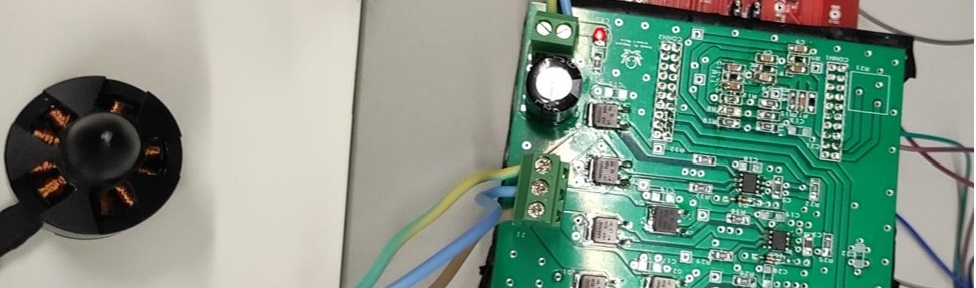
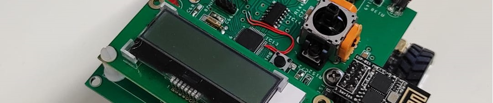
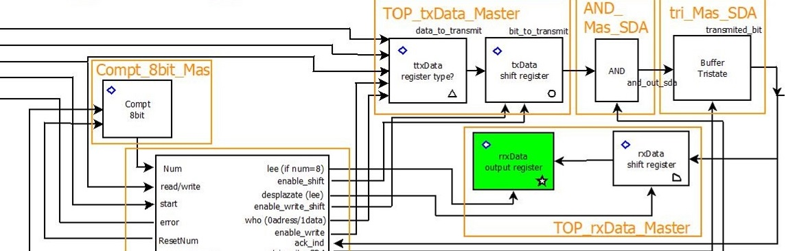
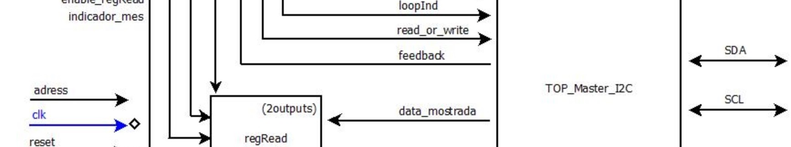

<!-- Encabezado -->
## ¡Hola! Soy Albert 👋

<!-- Descripción -->
### Sobre mí

Estudiante en su último curso de Ingeniería Electrónica de Telecomunicaciones especializado en el desarrollo del hardware y software de sistemas encastados.
Actualmente tengo 5 proyectos subidos a GitHub.  
Correo de contacto: albertmataidanez@gmail.com   

<!-- Proyectos -->
## Proyectos destacados

### Control de un motor BLDC
  
Este proyecto consta de la programación de un MSP432 y del diseño y desarrollo de una PCB con función de un circuito ESC para controlar la rotación de un motor BLDC en bucle cerrado.   

### Control del DFRobot
  
En este proyecto se crea y se programa una placa de control con un MSP430 para que un pequeño vehículo electrónico tenga diferentes funciones como un control manual, seguimiento de luz, seguimiento de línea, etc.   

### Síntesis de I2C
  
En este proyecto se diseña un sistema I2C a nivel RTL y se verifica su funcionamiento mediante una FPGA.   

### Síntesis de un sistema para SHTC3
  
En este proyecto se diseña y sintetiza a nivel RTL un sistema capaz de usar el módulo de I2C creado en el proyecto "Síntesis de I2C" para comunicarse con un sensor de temperatura y humedad.   

<!-- Pie de página -->

	¡Gracias por visitar mi perfil! 💻

